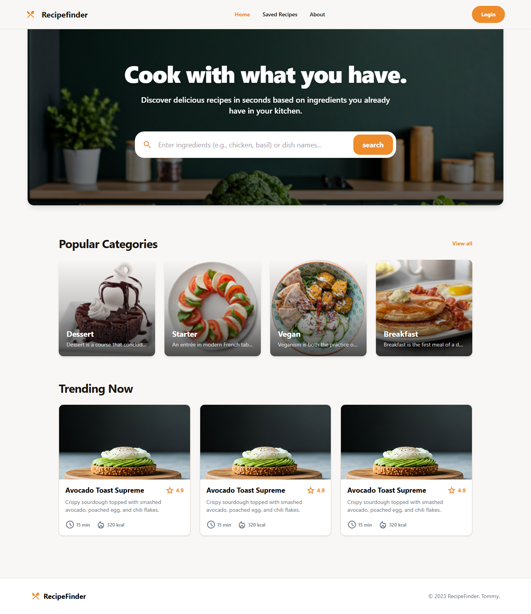
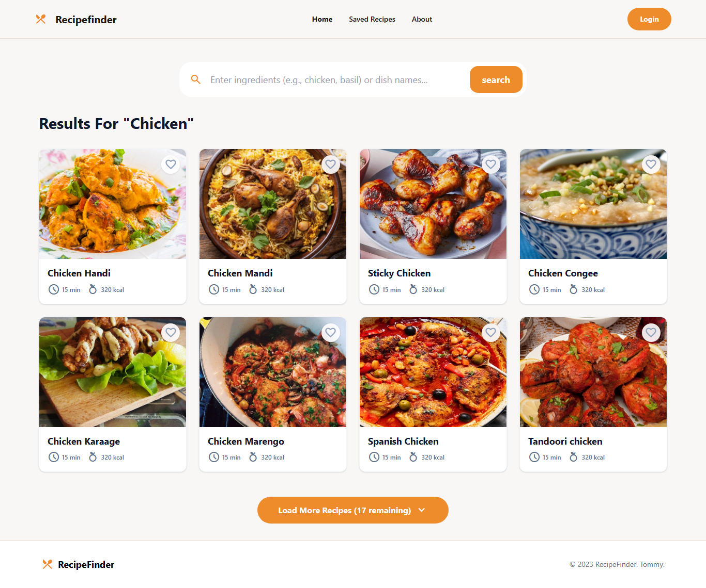
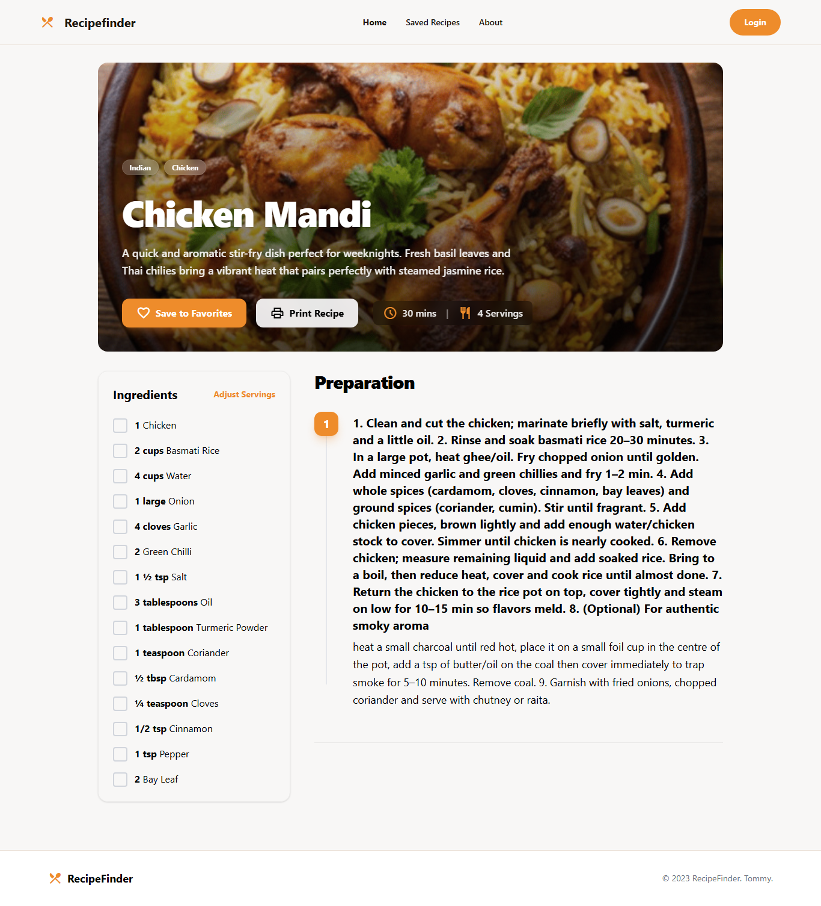

# RecipeFinder

A modern web application that helps users discover delicious recipes based on ingredients they already have in their kitchen. Built with React, React Router, and TanStack Query.



## Overview

RecipeFinder is your go-to kitchen companion that transforms the question "What can I cook with what I have?" into delicious meal possibilities. Simply enter the ingredients you have on hand, and discover recipes you can make immediately.

## Features

### 1. Smart Ingredient-Based Search

Search for recipes by entering ingredients you have in your kitchen or specific dish names. The app intelligently matches your input with recipes from TheMealDB API.



### 2. Comprehensive Recipe Details

Each recipe page provides:

- **Hero Section**: Recipe image, title, description, and key metrics
- **Ingredients List**: Clean, organized display of all ingredients with measurements
- **Step-by-Step Instructions**: Properly formatted preparation steps
- **Nutritional Information**: Quick glance at cooking time and calories
- **User Ratings**: Community feedback and reviews section



### 3. Recipe Organization

- **Categories**: Browse recipes by type (Dessert, Starter, Vegan, Breakfast)
- **Trending Now**: Discover popular recipes
- **Save to Favorites**: Bookmark recipes for later (coming soon)
- **Print Recipe**: Easy-to-print recipe format

### 4. User Interface

- **Responsive Design**: Seamless experience across desktop, tablet, and mobile
- **Dark Mode Support**: Easy on the eyes during nighttime cooking
- **Breadcrumb Navigation**: Clear navigation path through the app
- **Load More Functionality**: Paginated results for better performance

## Technology Stack

### Frontend

- **React 18**: Modern UI library with hooks and functional components
- **React Router v6**: For seamless navigation and route protection
- **TailwindCSS**: Utility-first styling for responsive design
- **TanStack Query (React Query)**: Efficient data fetching, caching, and state management

### Key Dependencies

```json
{
  "react": "^18.2.0",
  "react-router-dom": "^6.x",
  "@tanstack/react-query": "^4.x",
  "tailwindcss": "^3.x"
}
```
